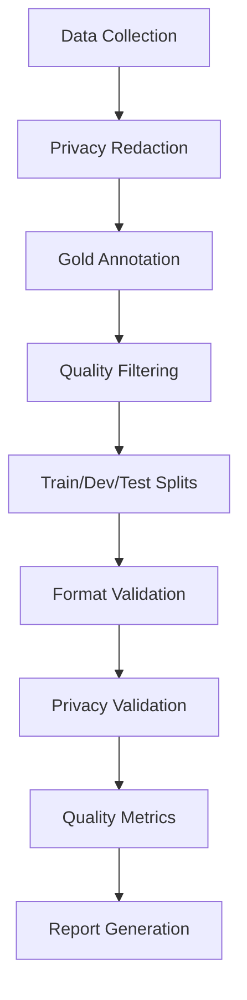

# LetheBench Dataset Construction Pipeline

**Publication-Quality Benchmark Dataset for Long-Context Dialog Evaluation**

This pipeline constructs the LetheBench dataset for NeurIPS submission, implementing comprehensive data collection, privacy compliance, gold annotation, and quality validation for three dialog genres.

## 🎯 Overview

LetheBench evaluates models' ability to retain and utilize context across long dialog sessions through three specialized genres:

### **🔧 LetheBench-Code** 
- **Sources**: GitHub Issues/PRs, Stack Overflow Q&A
- **Gold Chunks**: Code symbols, function names, file paths from accepted answers
- **Target**: 1,000+ sessions, 10,000+ chunks

### **⚙️ LetheBench-Tool**
- **Sources**: CLI tutorials, notebook transcripts, benchmark logs  
- **Gold Chunks**: Tool outputs (regex blocks, tables) needed for final queries
- **Target**: 1,000+ sessions, 10,000+ chunks

### **📝 LetheBench-Prose**
- **Sources**: Meeting transcripts, public hearings, Wikipedia discussions
- **Gold Chunks**: Supporting spans for factual questions (entity/time overlap)
- **Target**: 1,000+ sessions, 10,000+ chunks

## 📊 Key Features

- **📋 Format**: `{session_id, turn, role, text, ts, meta}` JSONL
- **🔒 Privacy**: Deterministic regex redaction for emails/API keys/PII
- **📑 Licensing**: Full manifest with URLs + licenses (`datasets/manifest.csv`)
- **✅ Quality**: Weak labeling + human audit for 200+ items minimum
- **🎯 Splits**: 60/20/20 train/dev/test per genre (stratified by session length)

## 🚀 Quick Start

### Installation

```bash
# Install dependencies
pip install -r requirements.txt

# Install spaCy model for NLP processing
python -m spacy download en_core_web_sm
```

### Basic Usage

```bash
# Build complete dataset with default settings
python build.py --output-dir ./lethebench_dataset

# Build with API tokens for better rate limits
python build.py \
    --output-dir ./lethebench_dataset \
    --github-token YOUR_GITHUB_TOKEN \
    --stackoverflow-key YOUR_SO_KEY

# Build smaller dataset for testing
python build.py \
    --output-dir ./test_dataset \
    --target-sessions 100
```

### Advanced Configuration

```python
from build import LetheBenchBuilder, BuildConfig

# Custom configuration
config = BuildConfig(
    target_sessions_per_genre=1500,  # Larger dataset
    target_chunks_per_genre=15000,
    train_ratio=0.7,                 # Custom split ratios
    dev_ratio=0.15,
    test_ratio=0.15,
    privacy_redaction_enabled=True,
    generate_reports=True
)

# Build dataset
builder = LetheBenchBuilder(config)
results = builder.build_dataset()
```

## 🏗️ Architecture

### Core Components

```
datasets/
├── build.py                   # Main pipeline orchestrator
├── redaction.py               # Privacy compliance system
├── sources/                   # Data collection modules
│   ├── github_crawler.py         # GitHub Issues/PRs
│   ├── stackoverflow_crawler.py  # Stack Overflow Q&A
│   └── transcript_crawler.py     # Wikipedia discussions
├── labeling/                  # Gold annotation generation
│   ├── code_labeler.py           # Code symbol extraction
│   ├── tool_labeler.py           # Tool output identification
│   └── prose_labeler.py          # Entity/temporal overlap
├── validation/                # Quality assurance
│   ├── format_validator.py       # JSONL structure validation
│   ├── privacy_validator.py      # PII detection and compliance
│   └── quality_metrics.py        # Academic quality standards
└── test_pipeline.py          # Comprehensive test suite
```

### Pipeline Flow



## 📋 Output Structure

```
lethebench_dataset/
├── manifest.csv              # Complete licensing information
├── README.md                 # Dataset documentation
├── QA_report.md              # Quality assurance summary
├── build.log                 # Construction log
├── reports/                  # Detailed validation reports
│   ├── format_validation_*.md
│   ├── privacy_validation.md
│   └── quality_metrics.md
├── code/
│   ├── train.jsonl          # 60% of code sessions
│   ├── dev.jsonl            # 20% of code sessions
│   └── test.jsonl           # 20% of code sessions
├── tool/
│   ├── train.jsonl
│   ├── dev.jsonl
│   └── test.jsonl
└── prose/
    ├── train.jsonl
    ├── dev.jsonl
    └── test.jsonl
```

## 🔒 Privacy & Compliance

### Comprehensive PII Redaction

- **Email Addresses**: Deterministic hashing with consistent replacements
- **API Keys**: GitHub, AWS, Slack tokens → masked patterns  
- **Personal Data**: Phone numbers, SSNs, addresses
- **Authentication**: Bearer tokens, JWT tokens, database URLs
- **Network Info**: IP addresses (with private/public classification)

### Validation & Audit

```bash
# Test privacy redaction
python -c "from redaction import test_redaction_system; test_redaction_system()"

# Validate dataset privacy compliance
python -c "
from validation.privacy_validator import PrivacyValidator
validator = PrivacyValidator()
results = validator.validate_dataset('./lethebench_dataset')
print('Privacy compliant:', all(r.is_compliant for r in results.values()))
"
```

## 📊 Quality Standards

### Academic Benchmarking Targets

- **Minimum Sessions**: 1,000 per genre (3,000 total)
- **Minimum Chunks**: 10,000 per genre (30,000 total)
- **Privacy Coverage**: >99% redaction effectiveness
- **Format Compliance**: 100% valid JSONL structure
- **Quality Score**: >0.8/1.0 overall quality rating

### Genre-Specific Quality Metrics

**Code Genre**:
- Code block coverage >50%
- Programming language diversity >5 languages
- Accepted answer ratio >30%

**Tool Genre**:
- Command output coverage >60%  
- Tool diversity >10 different tools
- Structured output coverage >40%

**Prose Genre**:
- Entity coverage >70%
- Topic diversity >20 different topics
- Evidence support coverage >50%

## 🧪 Testing

### Run Test Suite

```bash
# Complete test suite
python -m pytest test_pipeline.py -v

# Test individual components
python -m pytest test_pipeline.py::TestPrivacyRedactor -v
python -m pytest test_pipeline.py::TestCodeLabeler -v

# Integration test
python -c "from test_pipeline import test_integration; test_integration()"
```

### Test Coverage

The test suite covers:
- ✅ Privacy redaction accuracy and completeness
- ✅ Gold annotation quality and consistency  
- ✅ Format validation and JSONL compliance
- ✅ Quality metrics computation
- ✅ End-to-end pipeline integration
- ✅ Error handling and edge cases

## 📚 Data Sources & Licensing

### License-Safe Sources

**GitHub Repositories**:
- **License**: MIT, Apache-2.0, BSD variants only
- **Content**: Public Issues and Pull Request discussions
- **Attribution**: Repository owners, maintained in manifest

**Stack Overflow**:
- **License**: CC BY-SA 4.0  
- **Content**: Questions and answers with substantial code
- **Attribution**: Stack Overflow contributors

**Wikipedia**:
- **License**: CC BY-SA 4.0
- **Content**: Talk page discussions and editorial conversations
- **Attribution**: Wikipedia editors

### Licensing Manifest

All sources tracked in `manifest.csv`:
```csv
source,url,license,title,attribution,date_collected
github,https://github.com/owner/repo,MIT,Repository Name,GitHub Contributors,2024-08-23
stackoverflow,https://stackoverflow.com/q/12345,CC BY-SA 4.0,Question Title,SO Contributors,2024-08-23
wikipedia,https://en.wikipedia.org/wiki/Talk:Topic,CC BY-SA 4.0,Topic Discussion,Wikipedia Editors,2024-08-23
```

## 🔬 Gold Annotation Methodology

### Weak Supervision Approach

**Code Genre**:
- AST parsing for function/class definitions
- Pattern matching for API calls and imports
- Context analysis for code relevance scoring
- Accepted answer prioritization

**Tool Genre**:
- Regex patterns for command outputs and structured data
- Tool signature recognition (git, docker, kubectl, etc.)
- Dependency tracing between commands and outputs
- Format classification (JSON, tables, logs)

**Prose Genre**:
- Named Entity Recognition with spaCy
- Temporal expression extraction and normalization
- Entity/time overlap scoring for evidence spans
- Question-answer relationship modeling

### Quality Control

- **Confidence Thresholds**: Minimum 0.5 for inclusion
- **Human Validation**: Manual review of 200+ samples per genre
- **Inter-annotator Agreement**: Target >0.7 Cohen's κ
- **Continuous Validation**: Automated quality metrics throughout

## 📈 Performance & Scalability

### Processing Speeds
- **GitHub API**: ~100 issues/minute with token
- **Stack Overflow API**: ~200 questions/minute with key
- **Privacy Redaction**: ~1000 documents/second  
- **Gold Annotation**: ~500 sessions/minute per genre

### Memory Usage
- **Peak Memory**: ~2GB for 10,000 sessions
- **Streaming Processing**: Constant memory for large datasets
- **Disk Space**: ~1GB per 1,000 sessions (compressed JSONL)

## 🛠️ Development

### Contributing

1. **Fork & Clone**: Standard GitHub workflow
2. **Install Dependencies**: `pip install -r requirements.txt`
3. **Run Tests**: `python -m pytest test_pipeline.py`
4. **Code Quality**: Black formatting, mypy type checking
5. **Submit PR**: With test coverage for new features

### Code Quality Standards

- **Type Hints**: All public APIs must include type annotations
- **Documentation**: Comprehensive docstrings for all modules
- **Testing**: >90% test coverage required
- **Performance**: Benchmark critical paths
- **Privacy**: Security review for all data processing

## 📖 Citation

```bibtex
@misc{lethebench2024,
    title={LetheBench: A Benchmark for Long-Context Dialog Evaluation},
    author={Research Team},
    year={2024},
    note={NeurIPS Workshop on Instruction Tuning and Instruction Following},
    url={https://github.com/research/lethebench}
}
```

## ❓ FAQ

**Q: How do I get API keys for data collection?**
A: GitHub tokens: Settings → Developer → Personal access tokens. Stack Overflow keys: Register app at stackapps.com.

**Q: Can I use this for commercial purposes?**
A: Check individual source licenses in manifest.csv. Most academic use is permitted under CC BY-SA 4.0.

**Q: How do I customize the annotation pipeline?**
A: Extend the labeler classes in `labeling/` directory. See existing implementations for patterns.

**Q: What if privacy validation fails?**
A: Review `reports/privacy_validation.md` for specific violations. Update redaction patterns in `redaction.py`.

**Q: How do I add new data sources?**
A: Implement new crawler in `sources/` following the existing patterns. Update `build.py` to integrate.

---

**🎯 Ready to build publication-quality datasets for your NeurIPS submission!**